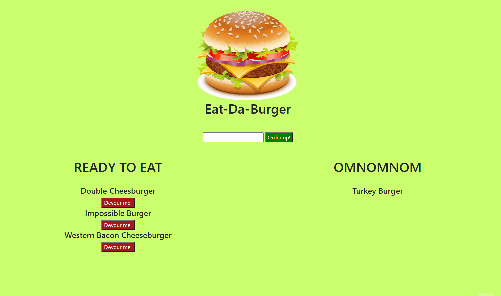

# Eat Da Burger
[](https://www.mit.edu/~amini/LICENSE.md)
<br>
 Developers are often tasked with creating interfaces that make it easy for non-developers to view and interact with information stored in databases. Often these interfaces are known as Content Management Systems. This repository architects and builds a solution for managing a company's employees using node, inquirer, and MySQL.

 ## Table of Contents:
* [Built With](#Built-With)
* [Dependencies](#Dependencies)
* [Installation](#Installation)
* [Features](#Features)
* [Code Explained](#Code-Explained)
    1.[ORM](#ORM)
    2.[Model](#Model)
    3.[Controller](#Controller)
    4.[AJAX](#AJAX)
*[Deployed Link](#Deployed-Link)
*[Repository Link](#Repository-Link)
*[Author](#Author)


  
 ## Built With
* MySQL
* Handlebars
* Express
* JawsDB
* jQuery
* JavaScript
* HTML/CSS

## Dependencies
* [Express](https://www.npmjs.com/package/express)
* [Express-Handlebars](https://www.npmjs.com/package/handlebars)
* [MySQL](https://www.npmjs.com/package/mysql)

## Installation
To install dependencies run:
```
npm install
```
To run locally with node:
```
node server.js
```
It should run through express or locally on localhost on port 8080 :
```javaScript
var PORT = process.env.PORT || 8080;
```

For a preview with a database hosted through JawsDB click [here.](https://eat-da-burger-yum.herokuapp.com/)
To run database locally you must install MySQL and create a local server. Make sure your port, user, and password match. To create the compatible tables you must run the schema.sql file in your workbench.
You can include some provided table data by running the seeds.sql in your workbench as well.
Please make sure the following match your personal MySql information, and that the database is set to "burgers_db".

```javaScript
var connection;

if(process.env.JAWSDB_URL){
connection = mysql.createConnection(process.env.JAWSDB_URL);
}else{
  connection = mysql.createConnection({
  host: "localhost",
  port: 3306,
  user: "root",
  password: "password",
  database: "burgers_db"
});
};

```

## Features
Eat-Da-Burger uses ORM to communicate with MySQL, and Express to grab data from AJAX calls to create/read/update data on our page. Burgers can be created and added to the "Ready to Eat" list. If the "Devour me!" button is clicked, the burgers "devoured" status is updated and moved to the "Omnomnom" list when eaten.

<br>



<br>

## Code Explained
### ORM
ORM: Our ORM in the config directory templates the MySQL commands. In this case there is only one table called "burgers" which allows it to be coded into the commands. If we were dealing with mutliple tables we would have to create a variable to pass the table name into. "cb" is passed into each function as our callback to deal with async issues.

<br>  

```javaScript

var orm = {
    selectAll: function(cb) {
        var queryString = "SELECT * FROM burgers";
        connection.query(queryString, function(err, result) {
          if (err) throw err;
          cb(result);
        });
      },

    insertOne: function(newVal, cb) {
        var queryString = "INSERT INTO burgers (burger_name) VALUES (?)";
        connection.query(queryString, [newVal], function(err, result) {
          if (err) throw err;
          cb(result);
        });
      },

    updateOne: function(upID, cb) {
        var queryString = "UPDATE burgers SET devoured = true WHERE id =" + upID;
        connection.query(queryString, function(err, result) {
          if (err) throw err;
          cb(result);
        });
      },

    
};

```

<br>

### Model
Our model grabs our ORM and passes our new function on to the controller. 
<br>

```javaScript

var burger = {
  selectAll: function(cb) {
    orm.selectAll(function(res) {
      cb(res);
    });
  },
  insertOne: function(newVal, cb) {
    orm.insertOne(newVal, function(res) {
      cb(res);
    });
  },
  updateOne: function(upID, cb) {
    orm.updateOne(upID, function(res) {
      cb(res);
    });
  }
};

```
<br>

### Controller
Our controller is the main communicator the data and the user. Using Express we can get info (like user inputs), post new info, and update current info. It tells the program how to handle the data and renders the html onto the page.

<br>

```javaScript

router.get("/", function(req, res) {
    burger.selectAll(function(data) {
      var hbsObject = {
        burgers: data
      };
      // console.log(hbsObject);
      res.render("index", hbsObject);
    });
  });
  
  router.post("/api/burgers", function(req, res) {
    burger.insertOne([
      req.body.burger_name
    ], function(result) {
      // Send back the ID of the new burger
      res.json({ id: result.insertId });
    });
  });
  
  router.put("/api/burgers/:id", function(req, res) {
    burger.updateOne(req.body.thisID, function(result) {
        console.log(result)
        if (result.changedRows == 0) {
          // If no rows were changed, then the ID must not exist, so 404
          return res.status(404).end();
        } else {
          res.status(200).end();
        }
    });
  });
```
<br>

### AJAX
AJAX calls are used on click/submit to respond to page events. When the "Order up!" form is submitted the new data is added to an api page to be grabbed in the controller and sent the new/updated input to the database.

```javaScript
 $("#addburger").on("submit", function(event) {
    event.preventDefault();

    var newBurger = {
      burger_name: $("#new-burger").val().trim()
    };

    // Send the POST request.
    $.ajax("/api/burgers", {
      type: "POST",
      data: newBurger
    }).then(
      function() {
        console.log("added new burger");
        // Reload the page to get the updated list
        location.reload();
      }
    );
  });

   $(".devourBtn").on("click", function(event) {
    // Make sure to preventDefault on a submit event.
    event.preventDefault();

    var thisid = $(this).data("burgerid");

    //console.log(thisid)

    var newDev = {
      thisID: thisid
    }

    $.ajax("/api/burgers/" + thisid, {
      type: "PUT",
      data: newDev
    }).then(
      function() {
        console.log("UPDATED");
        // Reload the page to get the updated list
        location.reload();
      }
    );
  });
```

<br>
<br>

## Deployed Link:
https://eat-da-burger-yum.herokuapp.com/

## Repository Link:
https://github.com/joshglugatch/Eat-Da-Burger

<br>

### Author:
Josh Glugatch  

[](https://github.com/joshglugatch)
<br>
[](www.linkedin.com/in/joshua-glugatch)


